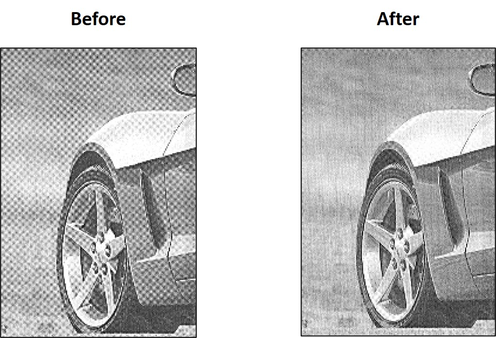
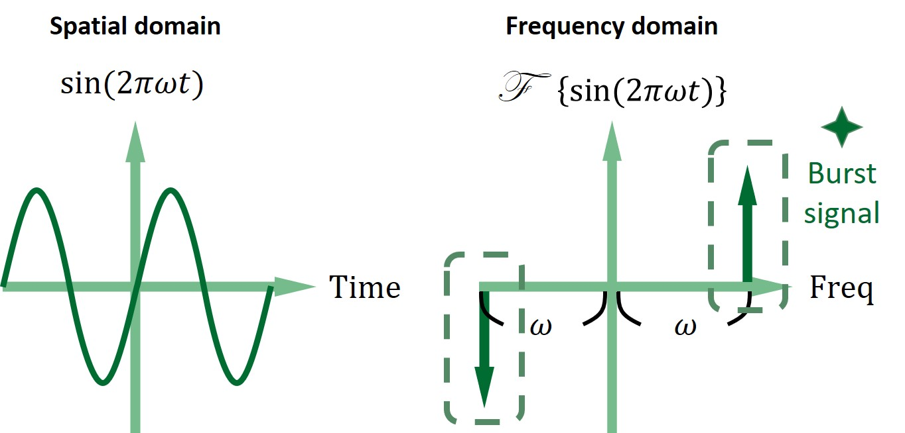
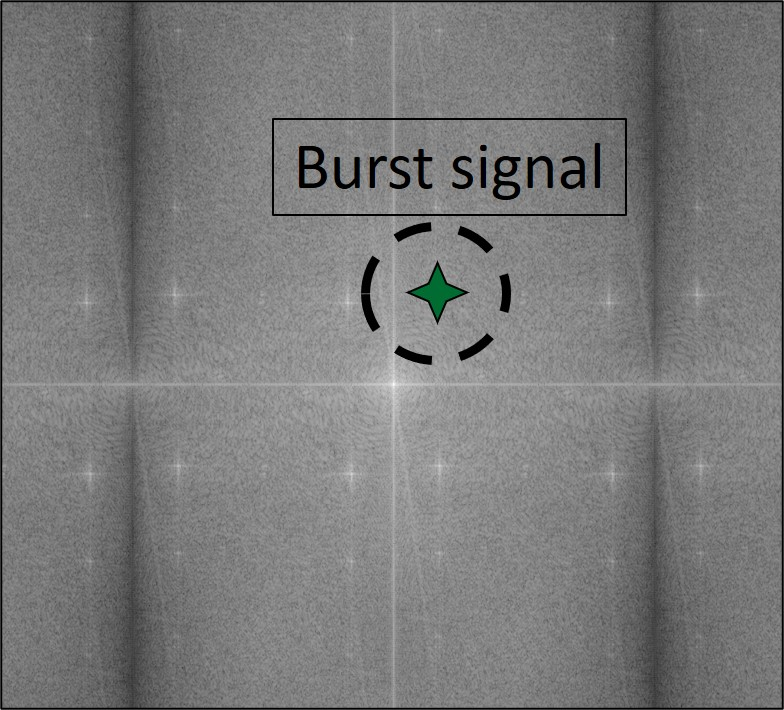
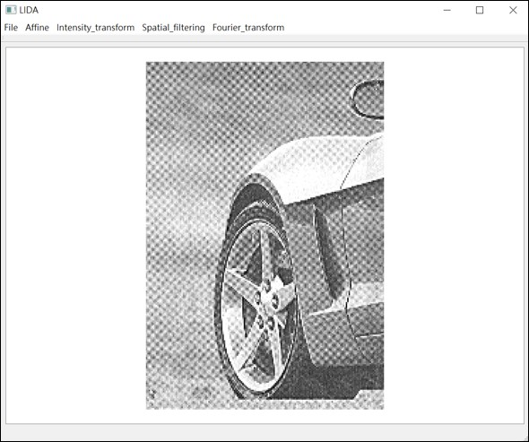
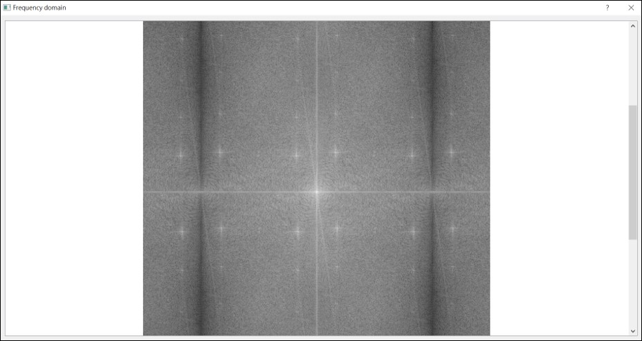
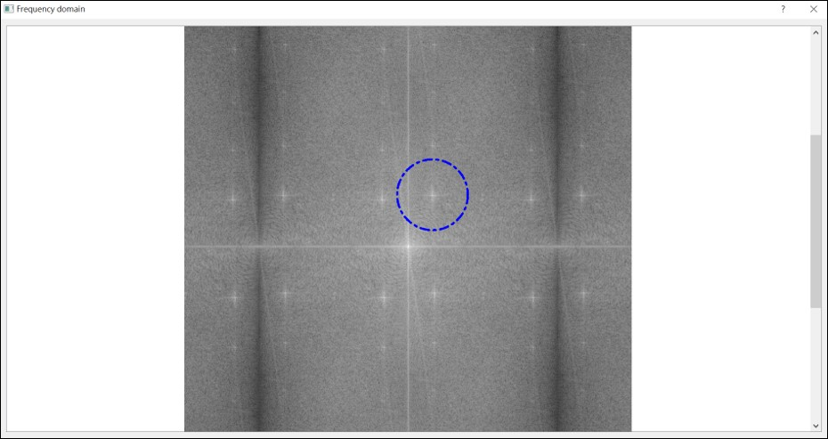
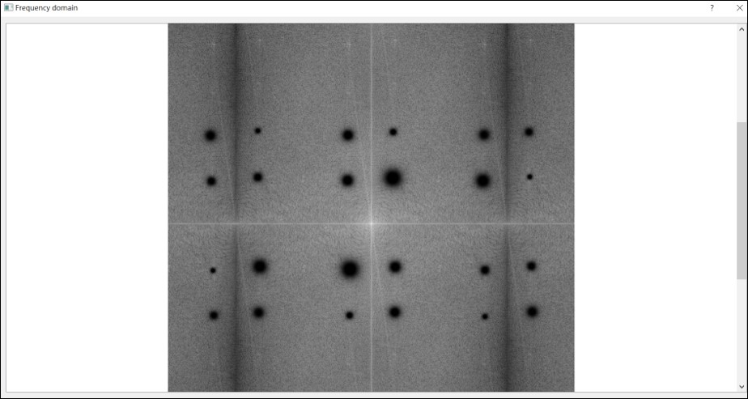
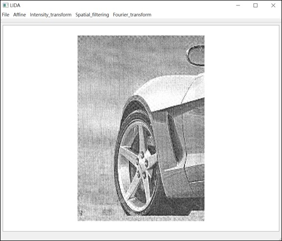

# Periodic noise filtering
This project is inspired by both Chapter 4 and 5 in "Digital Image Processing 3th edition", one of the great experiences in finishing the project is trying to compose all of the neccesary skill that I have learned thus far, including integration(Calculus), fourier transform(Engineer mathematics), programming skills and design user interface, the filtering effect is amazing too and although I demonstrate here using grayscale images, but actually my program is also taking color images into account, moreover part of the flickering image with very periodic behavior is able to be filter too.

    
   
    

# Implementation
The concept of periodic noise filtering is by using the fact that periodic signal in spatial domain corresponds to impulse signal in frequency domain, the following graph illustrates the situation where using sine function for instance:

**Graphical illustration in 1 dimensional domain**  
Periodic signal in 1 dimensional becomes point impulse signal symmetric around origin in frequency domain:

    
   
    

**Graphical illustration in 2 dimensional domain**  
Here's another instance generated by transforming the entire image with periodic noise into frequency domain, we can see from the graph there're point impulse signal symmetric around origin:

    
   
    

# User interface
Here we have a user interface to perform motion deblur by the following steps:

**Step 1.** Load image  
To click on "File->load" to load image

    
   
    

**Step 2.** Fourier transform  
To click on "Fourier_transform->Selective_filtering" to jump into another window showing the frequency domain of the image:

    
   
    

**Step 3.** Region selection  
To double click on the graph to generate a circle surronding the impulse signal:

    
   
    

**Step 4.** High pass filter around selected region  
After Step 3. is finished, the program would automatically apply high pass filter at both point mirror around origin, since periodic is always symmetric around origin:

    
   
    

**Step 5.** Final result  
After we finish filtering all the point impulse signal we can just close the window, once the window is closed the program will transforming the entire image back into spatial domain, and from the graph we can see the image is clear now:

    
   
    

